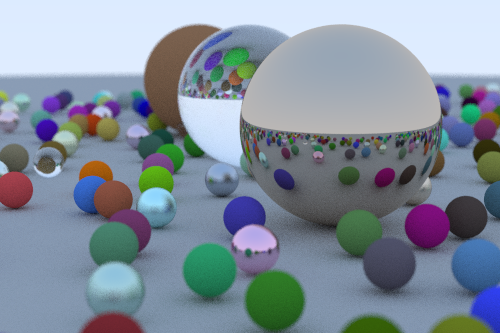

# lua-raytracer

An implementation of [Ray Tracing in One Weekend](https://raytracing.github.io/books/RayTracingInOneWeekend.html).



```sh
lua main.lua
display out.ppm
```

## Options

```
Usage: main.lua [--output <output>] [--width <width>]
       [--aspect-ratio <aspect_ratio>] [--samples <samples>]
       [--max-depth <max_depth>] [--seed <seed>] [-h]

Options:
   --output <output>,              Output PPM filename (default: out.ppm)
         -o <output>
   --width <width>,                Output image width (default: 500)
        -w <width>
   --aspect-ratio <aspect_ratio>,  Width / height (default: 1.5)
               -a <aspect_ratio>
   --samples <samples>,            Number of samples per pixel (default: 100)
          -s <samples>
   --max-depth <max_depth>,        Ray bounce limit (default: 50)
            -d <max_depth>
   --seed <seed>                   Random seed
   -h, --help                      Show this help message and exit.
```
